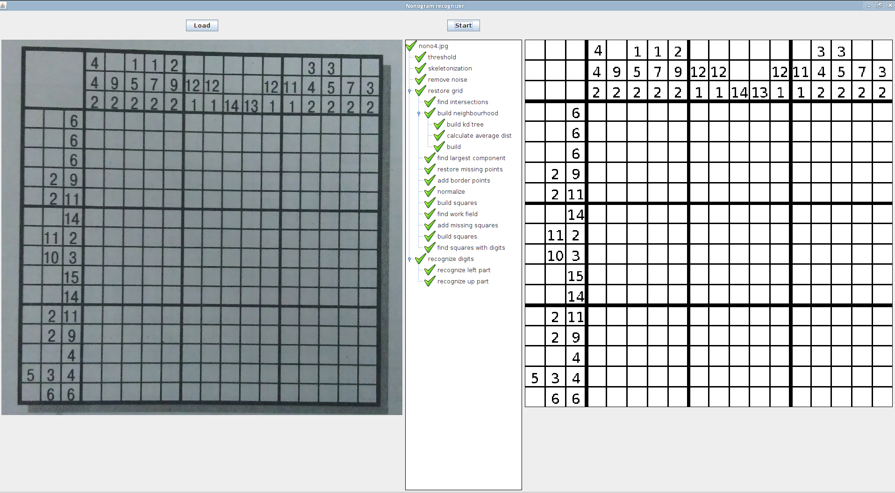
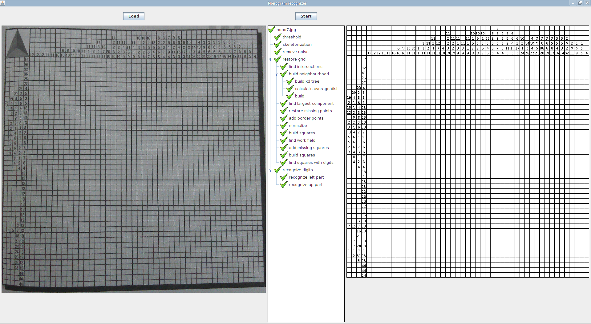

# Nonojure Recognition

Nonojure recognition is a library for parsing images of [nonogram](http://en.wikipedia.org/wiki/Nonogram) puzzles. Given image (photo) of a puzzle it tries it's best to parse it correctly.

### Installing

Installation is pretty complex because it uses [OpenCV](http://opencv.org/) java bindings.

Steps:

1. Install [leiningen](http://leiningen.org/).
2. Install OpenCV for java.
  a. Use [this](http://docs.opencv.org/2.4.4-beta/doc/tutorials/introduction/desktop_java/java_dev_intro.html) manual to download and compile OpenCV with java support.
  b. Copy `build/bin/opencv-246.jar` to `nonojure/recognition` folder and run: `lein localrepo install opencv-246.jar org.opencv/opencv 2.4.6`
  c. copy `build/lib/libopencv246.so` to `nonojure/recognition/resources/native/` folder.
3. Download [network.eg](https://www.dropbox.com/s/6eqjofaog2xtii7/network.eg) to `nonojure/recognition`. This file contains configuration for neural network so it can recognize digits.

### Run

Use `lein run` to run app. You can try images from `nonojure/recognition/resources/examples`. Please don't use `nono1.png`, `nono2.png`, `nono3.png` because they're not real photos and my app couldn't parse them. Well, you can try but it throws exception.

### Examples

Small nonogram in good quality, recognized very good:

Bigger nonogram, many digits are not parsed correctly:

